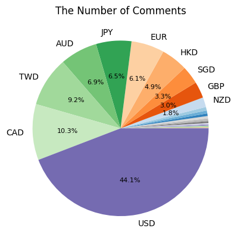
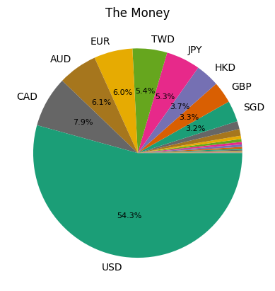
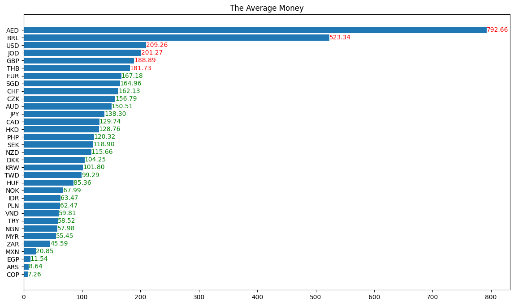

# How Much Wang Zhi An's apology make?
There has been much speculation about the income generated by Wang's apology video, but nobody gives the exact number. So, I decided to investigate it myself. The result, as many expected, is quite substantial.

The number of comment(without replies) is **31701**.

The number of paid comment(aka. sponsored) is **4034**.

The total amount is **686353.209827598** CNY / **96,053.322** USD.

The sponsorship in detail:

 

As you can see, most of the donated money is using USD.

In average, the people who uses USD to donate is more generous than the others.
The figure below shows the mean value of each currency. The currency with less
than the average value is colored in red, and the unit is CNY.



## Usage

```sh
git apply youtube.diff # merge my patch
yt-dlp https://www.youtube.com/watch?v=Jutrlp_6ww8 --write-comments --extractor-args "youtube:max_comments=all,all,0"
python chip.py
```
