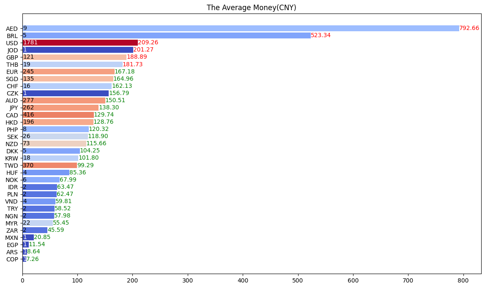

# How Much Wang Zhi An's apology make?

**Update:**

As Wang made his income public in a recent(2024-02-05) video, we could see that the income from Super Thanks is **8,602,198 JPY** (which is ~**414,608 CNY** / **57,871.519 USD**).

In our prediction, it should be `70% * 686,353 = 480,447` CNY / `70% * 96,053 = 67,237` USD. The error is ~17%, which is a little bit too much and may be caused by Google's using a different exchange rate than our.

---
There has been much speculation about the income generated by Wang's apology video, but nobody gives the exact number. So, I decided to investigate it myself. The result, as many expected, is quite substantial.

The number of comment(without replies) is **31701**.

The number of paid comment(aka. sponsored) is **4034**.

The total amount is about **686,353** CNY / **96,053** USD.

The sponsorship in detail:

 

As you can see, most of the donated money is using USD.

In average, the people who uses USD to donate is more generous than the others.
The figure below shows the mean value of each currency. The currency with less
than the average value is colored in green, and the unit is CNY.



## Usage

```sh
git apply youtube.diff # merge my patch
yt-dlp https://www.youtube.com/watch?v=Jutrlp_6ww8 --write-comments --extractor-args "youtube:max_comments=all,all,0"
python chip.py
```
